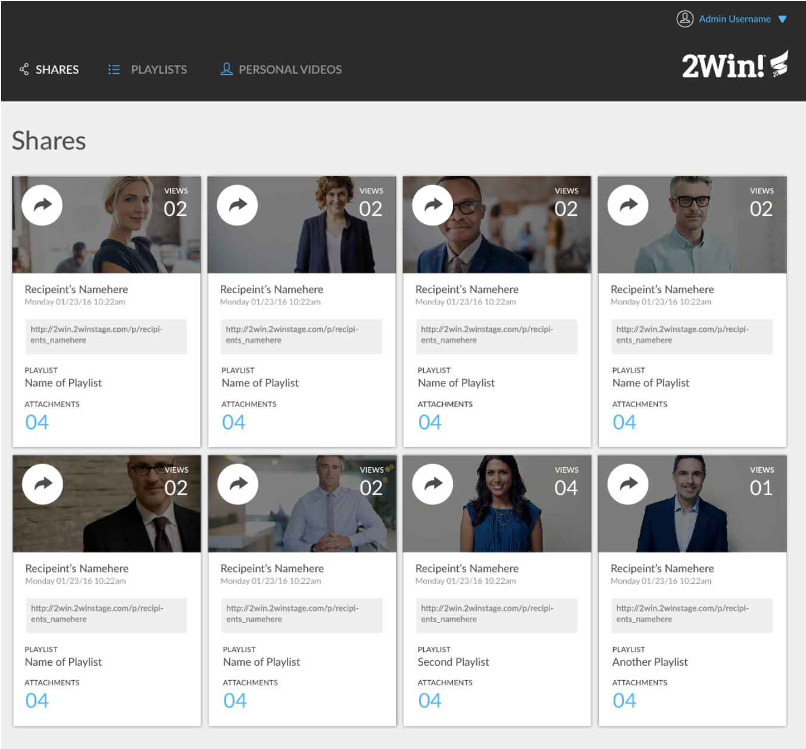

# hh-comp-challenge-1
## Overview
- Making a responsive site following the "original comp img" design. 
- Choosing appropriate copy, image, icons, and color palette for layout.
- Using tools such as flex-box and CSS styling for layout design.
- Site must work across Firefox, Safari, and Chrome.
- Must use normalize instaed of reset file in CSS.

## Original comp img

## My comp img

